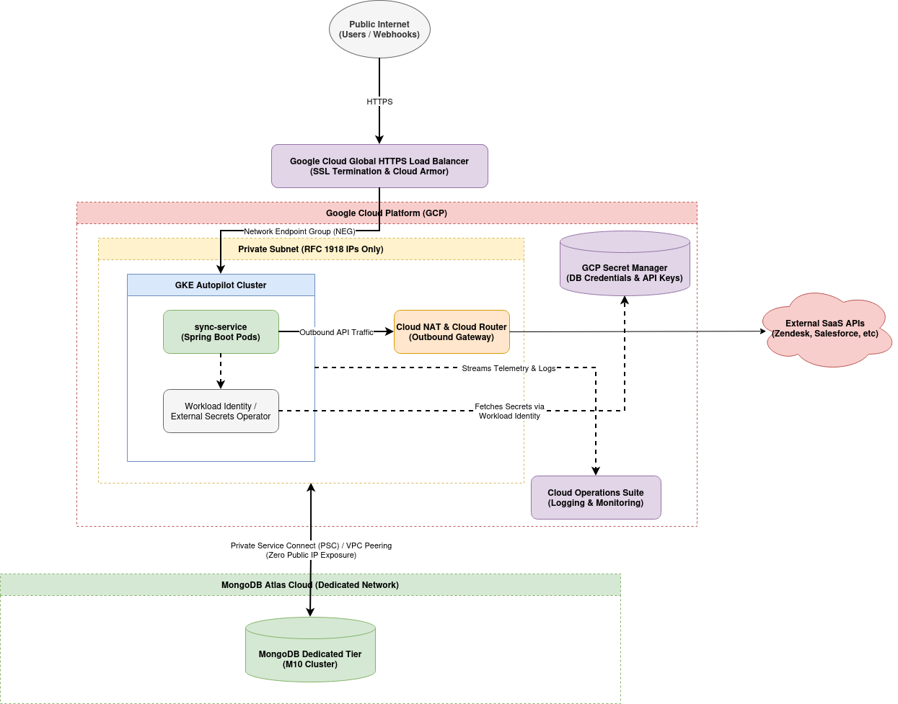

# Target Cloud Infrastructure Architecture: sync-service

This document outlines the proposed Google Cloud Platform (GCP) infrastructure design for the `sync-service`.

Instead of relying on static assumptions, this design evaluates scale, risk, and cost dynamically. Below are the core engineering requirements we need to clarify, followed by our conditional decision matrices and baseline recommendations.

---

## Executive Summary: Baseline Operating Assumptions

Before finalizing infrastructure choices, the architecture depends on three core variables:

* **User & Transaction Scale:** Are we supporting a few hundred early-stage users, or tens of thousands of corporate tenants with massive data pipelines?
* **Workload Processing Profile:** Is the sync logic triggered by short-lived HTTP webhooks, or does it run continuous, stateful background loops against MongoDB?
* **Application Lifecycle Design:** Is the application code built for an ephemeral runtime? Does it feature built-in distributed locking, or resumable processing states?

Based on these factors, we assume a **medium-to-high concurrency workload** with long-running database streams that cannot tolerate sudden timeouts. To support this under a **lean startup FinOps posture**, we must minimize idle compute, avoid managed service bloat, and keep operational overhead low for our small engineering team.

---

## 1. Compute Tier: Scaling Matrix & Selection

### The Decision Matrix

* **Option A: Cloud Run (Serverless):** Best for unpredictable, low-volume traffic to eliminate idle infrastructure costs.
* *The Catch:* Enforces a strict 60-minute execution limit. If `sync-service` uses continuous background loops or long-lived database cursors, Cloud Run will truncate processes mid-flight and risk data corruption. Additionally, rapid scaling triggers JVM cold starts that can quickly overwhelm MongoDB connection limits. This option is blocked unless the codebase implements distributed locking (e.g., ShedLock) and robust idempotency.

* **Option B: Compute Engine MIGs (VMs):** Best for predictable, steady baseline traffic. Offers fixed, predictable base pricing, and non-production environments can use **Spot VMs (Preemptible)** to cut costs by 60–80%.
* *The Catch:* Auto-scaling is slow due to full OS boot times and JVM warmups. Requires manual OS patching and image maintenance.

* **Option C: GKE Autopilot (Container Orchestration):** Best for scalable microservices and high-density pod layouts. Google manages the underlying nodes, and billing is tied strictly to active pod resource allocations.
* *The Catch:* Introduces configuration overhead (Ingress controllers, Network Policies, and CSI drivers) that might be excessive for early validation.

###  Recommendation: GKE Autopilot

**Why it fits:** It balances our constraints best. It provides rapid, pod-level auto-scaling (HPA) to manage sync volume spikes without charging for idle worker nodes. It completely circumvents Cloud Run's execution timeout risks for stateful backend workers, though we must accept the upfront complexity of setting up Kubernetes network and ingress configurations.

---

## 2. Database Tier: MongoDB Topology

### The Decision Matrix

* **Tier 1: Atlas Serverless:** Best for early prototyping and dev/test environments. Charging is based purely on exact read/write operations per second, ensuring zero cost when idle.
* **Tier 2: Atlas Dedicated M10/M20:** Best for production steady-state. Provides automated daily point-in-time recovery (PITR) and dedicated IOPS.
* **Tier 3: Distributed Sharded Cluster:** Best for multi-terabyte enterprise scale, heavy write amplification, or localized read-replicas to meet geo-fencing compliance.

###  Recommendation: MongoDB Atlas Dedicated M10 (Private Access)

**Why it fits:** Managing MongoDB on self-hosted GCP VMs takes too much engineering overhead. Atlas handles high availability and backups automatically. We will remove all public access and route traffic securely via **Private Service Connect (PSC)** or **VPC Network Peering** over Google’s private fiber backbone, ensuring zero public IP exposure.

---

## 3. Networking & Edge Ingress

### The Decision Matrix

* **Low-Scale Path:** Use direct VM ingress or Cloud Run native HTTPS, locked down tightly via Cloud Firewall rules. This bypasses the fixed monthly costs of a dedicated Global Load Balancer during early-stage validation.
* **Enterprise Path:** A centralized Global HTTPS Load Balancer (GLB) providing edge SSL termination, Cloud CDN integration, and Cloud Armor security/DDoS filtering.

###  Recommendation: Custom VPC + Global HTTPS Load Balancer (GLB) + Cloud NAT

**Why it fits:**

1. **Ingress:** External traffic enters securely through the GLB, leveraging Cloud Armor for edge security, and routes cleanly into the GKE cluster via Network Endpoint Groups (NEGs).
2. **Egress & Isolation:** The GKE cluster operates strictly within private subnets (RFC 1918 IPs). To pull data securely from external third-party APIs, outbound internet traffic is masked and routed through a managed **GCP Cloud NAT**, keeping internal infrastructure completely hidden from external network scans.

---

## 4. Identity, Access, and Secrets Management

To prevent credential leakage, plaintext credentials, cleartext property files, or long-lived JSON service account keys are strictly prohibited. Secrets must never touch static disks or code repositories.

###  Recommendation: GCP Secret Manager + Workload Identity

**Why it fits:**

* All sensitive variables (MongoDB URIs, external API keys) are centralized in **GCP Secret Manager**.
* For container topology, we use **GCP Workload Identity** to map Kubernetes Service Accounts (KSAs) directly to Google Cloud IAM Service Accounts.
* The application fetches these properties directly into volatile memory at boot time via transient, read-only permissions (`roles/secretmanager.secretAccessor`). *(Note: If any legacy workloads require a VM topology, they will pull runtime tokens securely using the Instance Metadata Service IMDSv2).*

---

## 5. Observability & FinOps Monitoring

### The Decision Matrix

* **Phase 1: Native Cloud Operations Suite:** Zero-maintenance infrastructure using native **GCP Cloud Logging** and **Cloud Monitoring** on a pay-as-you-go model. Avoids wasting engineering hours maintaining a separate monitoring cluster.
* **Phase 2: Open Source Stack (Grafana/Prometheus):** Necessary once log and metric volumes scale past high-volume thresholds. At that point, per-gigabyte ingestion fees in the cloud become cost-prohibitive, and transitioning to an internal ingestion pipeline (e.g., Vector or Fluentbit routing to a self-hosted Grafana LGTM or Prometheus stack on GKE) caps data costs.

###  Recommendation: Phase 1 (GCP Native) with Strict FinOps Controls

**Why it fits:** We will start with native GCP telemetry to save engineering time. However, to keep costs low and avoid runaway ingestion fees, we will enforce aggressive log exclusion filters at the edge to drop verbose `DEBUG` and `INFO` traces in production, locking log retention to a strict 30-day window. Alerting policies will focus only on core **Golden Signals** (Latency, Error Rates) and push directly to Slack to eliminate noise.